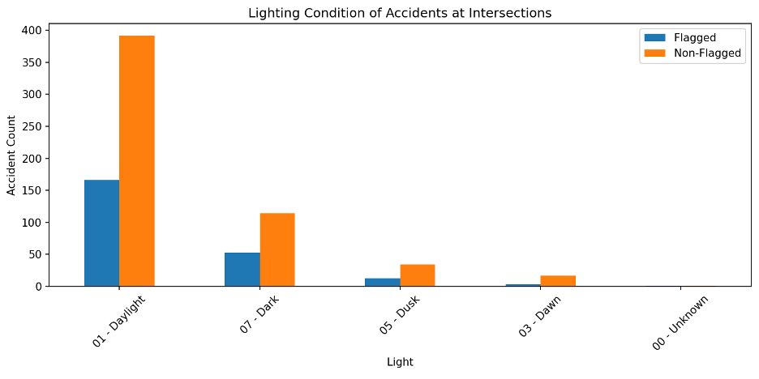

# 🚦 Intersection Insights: Analyzing Traffic Light Spacing & Accident Risk
## ✅ Requirements
- Python 3.10
- [Miniconda or Anaconda](https://docs.conda.io/en/latest/miniconda.html)
- Internet connection (required for map and geolocation queries)

---

## ⚙️ Installation (macOS, Windows, Linux)

### 1. Clone the Repository

```bash
git clone https://github.com/your-username/traffic-light-proximity.git
cd traffic-light-proximity
```

### 2. Create and Activate a Conda Environment

```bash
conda create -n traffic-geo python=3.10 -y
conda activate traffic-geo
```

### 3. Install Required Dependencies

```bash
conda install -c conda-forge \
  osmnx \
  geopandas \
  folium \
  matplotlib \
  shapely \
  networkx \
  scikit-learn \
  scipy \
  geopy \
  ipykernel -y
```
```bash
pip install tkintermapview
```

> ✅ **Note**: `tkinter` is included with most Python distributions. If you encounter errors:
> - On **macOS**: `brew install python-tk`
> - On **Ubuntu/Debian**: `sudo apt-get install python3-tk`
> - On **Windows**: It should already be available.

---

## ▶️ Running the Script
### From Command Line

```bash
python main.py
```

---

## 💻 Running in VS Code

1. Open the folder in VS Code.
2. Press `Ctrl + Shift + P` → search for `Python: Select Interpreter`.
3. Choose the `traffic-geo` conda environment.
4. Run your script from the integrated terminal.

---

## 📁 Output Files

All generated files (CSV summaries, heatmaps, charts, maps, and GeoJSON) will be saved to your selected export directory. Key outputs include:

- `ottawa_traffic_lights.geojson`
- `filtered_route_violations_50_200m.csv`
- `accident_counts_per_intersection.csv`
- `ottawa_map.html` (folium interactive map)
- `lighting_condition_bar_chart.png`
- Summary tables and stratified analysis CSVs

### 📍 Project Overview

This project investigates whether **closely spaced traffic signals** (less than 200 meters apart) are associated with **higher accident risk at intersections**.

The idea originated from a real-life close call at an intersection in Brampton — where short spacing between traffic lights likely contributed to a missed red light. That experience sparked the question:

> _Are there more such intersections in Brampton — or in other cities — where signal spacing may increase the risk of driver confusion and collisions?_

---

### 🌐 Scope & Generalization

- The **methodology is generalizable** to any city with open access to:
  - Road network and traffic light data (via OpenStreetMap)
  - Collision data with latitude/longitude (usually provided by municipalities)

- **Ottawa** is used as a case study because:
  - It has **freely available, well-formatted accident data**
> 🔎 Other cities (e.g., Toronto, Vancouver, NYC) could be analyzed using this same pipeline, provided accident data is available with sufficient location precision.

---

## 📁 Project Structure

This project involves geospatial analysis, accident data matching, and statistical testing to evaluate the hypothesis:  
> "Closely spaced traffic signals may confuse drivers and increase collision risk."

---

## 📍 Methodology Overview

| Step | Description |
|------|-------------|
| 1. **Data Sourcing** | OpenStreetMap (traffic lights) + City of Ottawa traffic collisions |
| 2. **Intersection Clustering** | Used DBSCAN to group nearby traffic lights into intersection clusters |
| 3. **Distance Filtering** | Flagged intersections 25–200m apart as “potentially problematic” |
| 4. **Accident Matching** | Mapped accidents to intersections via precise lat/lon matching |
| 5. **Accident Buffering** | Also checked accidents within 25m, 50m, 100m, 200m buffers |
| 6. **Filtering** | Included only accidents at traffic-signal-controlled intersections |
| 7. **Statistical Tests** | Chi-square, Mann-Whitney U, stratification by spacing, lighting condition analysis |
| 8. **Visualization** | Interactive map showing flagged intersections + accident heatmap |

---

## 📊 Key Findings

| Hypothesis | Result | Statistically Significant? |
|-----------|--------|----------------------------|
| Flagged vs. non-flagged intersections have more accidents | ❌ Not supported | p > 0.05 |
| Closer spacing (e.g., 50–100m) leads to more accidents | ❌ No trend | p > 0.05 |
| Flagged intersections more dangerous at night | ❌ No difference in lighting conditions | p > 0.05 |
| Flagged intersections align with accident hotspots | ⚠️ Mixed visual overlap | Visual only |
---


Shows accident density (heatmap) with flagged intersections by spacing group.
- 🔴 50–100m
- 🟠 100–150m
- 🟣 150–200m
🧭 Observation: No observations of area with many accidents
---

📈 Chart: Accidents by Lighting Condition
Bar chart comparing lighting conditions at flagged vs. non-flagged intersections:

✅ Both have similar distributions — most accidents happen in daylight, not at night.
---
🧠 Takeaways
Traffic light spacing alone is not a predictor of higher accident rates in Ottawa.
Lighting conditions and distance buckets (50–200m) did not significantly affect accident likelihood.

---

## 📈 Statistical Analysis

### ✅ Chi-Square Test
- Tested whether **flagged** intersections had a higher chance of ≥1 accident.
- **Result:** No significant difference (p > 0.05)

### ✅ Mann-Whitney U Test
- Tested whether **accident counts** per intersection differed across groups.
- **Result:** No significant difference between flagged and non-flagged groups.

### ✅ Stratification (50–100m, 100–150m, 150–200m)
- Measured % of intersections with ≥1 accident in each distance group.
- No distance group showed significantly more risk.

### ✅ Lighting Condition Analysis
- Compared lighting condition at time of accidents (day/dusk/night).
- Both flagged and non-flagged intersections showed similar distributions.


## 📌 Next Steps (Optional Future Work)

- Apply to other cities (Toronto, Vancouver, NYC)
- Integrate accident **text descriptions** via NLP to detect signal confusion
- Partner with municipalities for dashboard pilot
- Explore human factors & visual psychology research to support design changes

---

## 📎 Files Included

| File | Purpose |
|------|--------|
| `filtered_route_violations_50_200m.csv` | Intersections flagged for proximity |
| `accidents_exactly_at_intersections.csv` | Accident matches at flagged intersections |
| `flagged_intersections_with_closest_distance_group.csv` | Final grouped summary for analysis |
| `ottawa_accident_heatmap_with_flagged_intersections.html` | Interactive map |
| `accident_summary_by_distance_group.csv` | Stratified summary |
| `flagged_intersection_vs_non_flagged_intersection_MannWhitneyU.csv` | Mann-Whitney test results |

---

